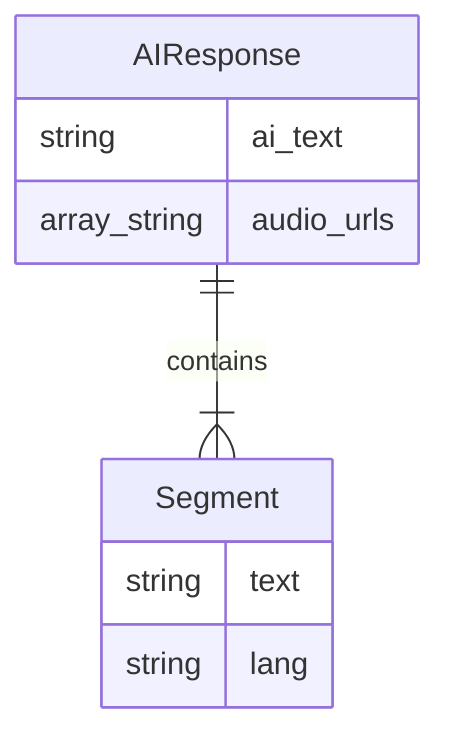

# Data Model: Bilingual Audio Response

**Date**: 2026-01-25
**Author**: Gemini

## 1. Objective

This document defines the data structures required to deliver a segmented, bilingual audio response to the client application, as specified in `spec.md` and informed by `research.md`.

## 2. Entity Relationship Diagram

## 3. Entity Definitions

### AIResponse

This is the main object returned by the backend API. It encapsulates the complete response, including the original text, the segmented text, and the corresponding audio resources.

| Attribute | Type | Description | Required | Example |
| :--- | :--- | :--- | :--- | :--- |
| `ai_text` | `string` | The full, unmodified text response generated by the AI. | Yes | `"'Hello' significa 'Olá'."` |
| `segments` | `Array<Segment>` | An ordered array of `Segment` objects. | Yes | `[{"text": "'Hello'", "lang": "en"}, {"text": " significa 'Olá'.", "lang": "pt"}]` |
| `audio_urls` | `Array<string>` | An ordered array of URLs. Each URL points to the audio file for the segment at the corresponding index in the `segments` array. | Yes | `["/audio/segment1.mp3", "/audio/segment2.mp3"]` |
| `conversation_id`| `string` | The unique identifier for the conversation session. | Yes | `"521b1dba-f74a-4824-9f3a-084eaead34f8"` |
| `user_text`| `string` | The original text sent by the user. | Yes | `"me ensine como utilizar o termo hello"` |

### Segment

Represents a contiguous, single-language portion of the `ai_text`.

| Attribute | Type | Description | Required | Example |
| :--- | :--- | :--- | :--- | :--- |
| `text` | `string` | The text content of this specific segment. | Yes | `"'Hello'"` |
| `lang` | `string` | The IETF language tag (e.g., "en", "pt") identifying the language of the `text`. | Yes | `"en"` |

## 4. State and Validation

- The number of elements in `audio_urls` MUST be equal to the number of elements in `segments`.
- The order of `audio_urls` MUST correspond to the order of `segments`.
- The `lang` field in `Segment` should conform to ISO 639-1 codes.
