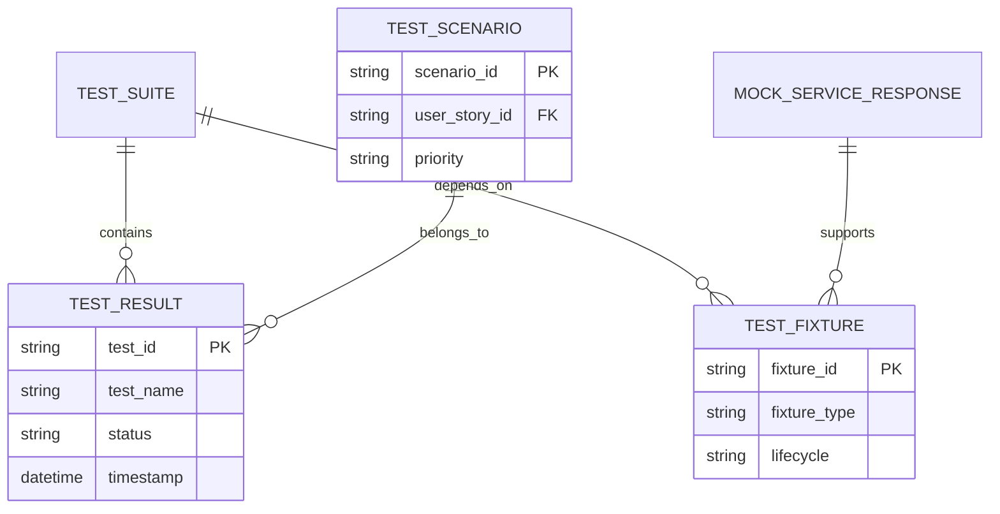

# Data Model: Integration and E2E Testing Framework

**Created**: 2026-06-12
**Feature**: [spec.md](spec.md)

---

## Test Entities

### 1. Test Result

Represents the outcome of a single test execution.

**Fields**:
- `test_id` (string, required) - Unique identifier for the test
- `test_name` (string, required) - Human-readable test name
- `test_file` (string, required) - Path to the test file
- `status` (enum: "passed", "failed", "skipped", "error", required) - Test execution status
- `duration_ms` (integer, optional) - Execution time in milliseconds
- `error_message` (string, optional) - Error details if test failed
- `stack_trace` (string, optional) - Full stack trace for debugging
- `timestamp` (ISO 8601 datetime, required) - When test was executed
- `coverage_percentage` (float, optional) - Code coverage for the test
- `tags` (array of strings, optional) - Tags for test categorization

**State Transitions**:
- `pending` → `passed` / `failed` / `skipped` / `error`
- No rollback after final state

**Validation Rules**:
- `test_id` MUST be unique per test run
- `duration_ms` MUST be positive if present
- `timestamp` MUST be in ISO 8601 format

---

### 2. Test Suite

Represents a collection of related tests (e.g., all backend integration tests).

**Fields**:
- `suite_id` (string, required) - Unique identifier for the suite
- `suite_name` (string, required) - Human-readable suite name
- `parent_suite_id` (string, optional) - Parent suite for nested suites
- `test_count` (integer, required) - Number of tests in the suite
- `passed_count` (integer, optional) - Number of passed tests
- `failed_count` (integer, optional) - Number of failed tests
- `skipped_count` (integer, optional) - Number of skipped tests
- `total_duration_ms` (integer, optional) - Total execution time
- `status` (enum: "pending", "running", "passed", "failed", required) - Suite execution status
- `created_at` (ISO 8601 datetime, required) - When suite was created
- `completed_at` (ISO 8601 datetime, optional) - When suite completed

**Relationships**:
- `parent_suite_id` → Self-referential for nested suites
- Contains multiple `Test Result` entities

**Validation Rules**:
- `test_count` MUST equal `passed_count + failed_count + skipped_count`
- `status` MUST be "pending" when `completed_at` is null

---

### 3. Test Fixture

Represents pre-test setup (mocks, containers, data preparation).

**Fields**:
- `fixture_id` (string, required) - Unique identifier
- `fixture_name` (string, required) - Human-readable name
- `fixture_type` (enum: "mock", "container", "data", "database", "file", required) - Type of fixture
- `setup_code` (string, optional) - Setup instructions/code
- `teardown_code` (string, optional) - Teardown instructions/code
- `dependencies` (array of strings, optional) - Other fixture IDs this depends on
- `is_global` (boolean, default: false) - Whether fixture is shared across tests
- `lifecycle` (enum: "test", "module", "session", "class", required) - Fixture lifecycle scope

**Validation Rules**:
- `is_global` and `lifecycle` MUST be consistent (global fixtures should use session lifecycle)
- `dependencies` MUST reference valid fixture IDs

---

### 4. Test Scenario

Represents a specific test case or scenario within a test file.

**Fields**:
- `scenario_id` (string, required) - Unique identifier
- `scenario_name` (string, required) - Human-readable name
- `user_story_id` (string, optional) - Links to user story from spec
- `priority` (enum: "P1", "P2", "P3", "P4", required) - Test priority
- `steps` (array of objects, required) - Test steps
- `expected_behavior` (string, required) - Expected outcome
- `tags` (array of strings, optional) - Tags for filtering

**Validation Rules**:
- `steps` array MUST have at least one step
- `priority` MUST be one of the defined enums

---

### 5. Mock Service Response

Represents a mock response from an external service.

**Fields**:
- `response_id` (string, required) - Unique identifier
- `service_name` (enum: "stt", "llm", "tts", required) - Which service is being mocked
- `endpoint` (string, required) - API endpoint being mocked
- `http_method` (enum: "GET", "POST", "PUT", "DELETE", required) - HTTP method
- `request_body_schema` (string, optional) - JSON schema for expected request body
- `response_body` (object, required) - Mock response JSON
- `http_status` (integer, default: 200, required) - HTTP status code
- `delay_ms` (integer, optional) - Simulated network delay
- `headers` (object, optional) - Response headers
- `is_error_response` (boolean, default: false) - Whether this is an error scenario

**Validation Rules**:
- `http_status` MUST be in range 100-599
- `delay_ms` MUST be positive if present
- `response_body` MUST be valid JSON

---

### 6. CI/CD Pipeline Configuration

Represents the CI/CD test execution pipeline.

**Fields**:
- `pipeline_id` (string, required) - Unique identifier
- `pipeline_name` (string, required) - Human-readable name
- `trigger_events` (array of strings, required) - When pipeline runs (push, PR, schedule)
- `jobs` (array of objects, required) - Test job definitions
- `artifacts` (array of strings, optional) - Files to preserve after build
- `timeout_minutes` (integer, default: 30) - Maximum execution time

**Validation Rules**:
- `trigger_events` MUST be from allowed list (push, pull_request, schedule)
- `timeout_minutes` MUST be positive

---

## Test Data Entities

### 7. Test Audio File

Represents test audio data for STT testing.

**Fields**:
- `audio_id` (string, required) - Unique identifier
- `language` (enum: ["pt", "en"], required) - Audio language
- `duration_seconds` (float, required) - Audio duration
- `sample_rate_hz` (integer, default: 16000) - Audio sample rate
- `format` (enum: ["wav", "webm", "mp3"], required) - Audio format
- `content_type` (string, required) - MIME type
- `file_path` (string, required) - Path to test audio file

**Validation Rules**:
- `duration_seconds` MUST be positive
- `sample_rate_hz` MUST be standard (8000, 16000, 22050, 24000, 44100, 48000)
- `content_type` MUST match `format` (e.g., "audio/wav" for wav)

---

### 8. Test Conversation Turn

Represents a single turn in a test conversation.

**Fields**:
- `turn_id` (string, required) - Unique identifier
- `user_input` (string, required) - User message or audio
- `user_input_type` (enum: ["text", "audio"], required) - Input type
- `user_language` (enum: ["pt", "en"], required) - User language
- `llm_response` (object, optional) - LLM response object
- `stt_transcription` (string, optional) - STT output
- `tts_audio_path` (string, optional) - TTS output path
- `processing_duration_ms` (integer, optional) - Total processing time
- `status` (enum: ["pending", "processing", "completed", "error"], required) - Turn status

**Validation Rules**:
- `user_input` MUST be non-empty
- `user_language` MUST match the language of `user_input`
- If `user_input_type` is "text", `stt_transcription` is optional
- If `user_input_type` is "audio", `stt_transcription` is required

---

## Relationships

---

## Notes

- All test entities use string IDs for flexibility and traceability
- Timestamps use ISO 8601 format for consistency and sorting
- Priority system (P1-P4) aligns with feature specification priorities
- Mock responses support error scenarios for comprehensive testing
- CI/CD configuration separates test execution from build artifacts
